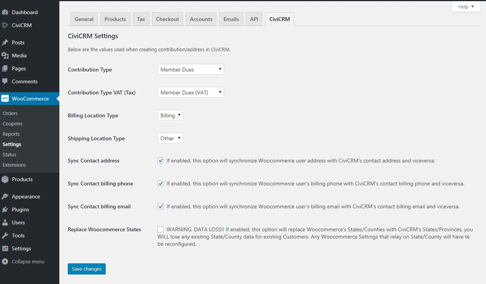

# WooCommerce CiviCRM Integration

## Installation

Step 1: Install Wordpress plugin

Install this Wordpress plugin as usual. More information about installing plugins in Wordpress - https://codex.wordpress.org/Managing_Plugins#Installing_Plugins

## Configuration

Configure the integration settings in Woocommerce Menu >> Settings >> CiviCRM (Tab)
Direct URL: https://example.com/wp-admin/admin.php?page=wc-settings&tab=woocommerce_civicrm

## Functionality

1. Woocommerce orders are created as contributions in CiviCRM. Line items are not created in the contribution, but the product name x quantity are included in the 'source' field of the contribution
2. Salex tax (VAT) & Shipping cost are saved as custom data against contribution
3. A global campaign can be defined for each contribution, but campaigns can be customized per order
4. Logged in users are recognised and the contribution is created against the related contact record
5. If not logged in, the plugin tries to find the contact record in CiviCRM using Dedupe rules and the contribution is created against the found contact record.
6. If the contact does not exist, a new contact record is created in CiviCRM and the contribution is created against the newly created contact record.
7. Related contact record link is added to the Woocommerce order as notes.
8. Option to sync CiviCRM and Woocommerce address, billing phone, and billing email. If a user edits his/hers address, billing phone, or billing email through the Woocommerce Account >> Edit Address page, CiviCRM profile, or through CiviCRM's backoffice, the data will be updated in both CiviCRM and Woocommerce.
9. Option to replace Woocommerce's States/Counties list with CiviCRM's State/Province list. (**WARNING!!!** Enabling this option in an exiting Woocommerce instance will cause **State/County data loss** for **exiting Customers** and **Woocommerce settings** that relay on those.)

## Developers
There are a few hooks available
* `woocommerce_civicrm_contribution_create_params` filter
* `woocommerce_civicrm_contribution_update_params` filter
* `woocommerce_civicrm_financial_types_params` filter
* `woocommerce_civicrm_campaigns_params` filter
* `woocommerce_civicrm_admin_settings_fields` filter
* `woocommerce_civicrm_address_map` filter
* `woocommerce_civicrm_mapped_location_types` filter
* `woocommerce_civicrm_utm_cookie_expire` filter
* `woocommerce_civicrm_wc_address_update` action
* `woocommerce_civicrm_civi_address_updated` action
* `woocommerce_civicrm_wc_phone_updated` action
* `woocommerce_civicrm_civi_phone_updated` action
* `woocommerce_civicrm_wc_email_updated` action
* `woocommerce_civicrm_civi_email_updated` action
